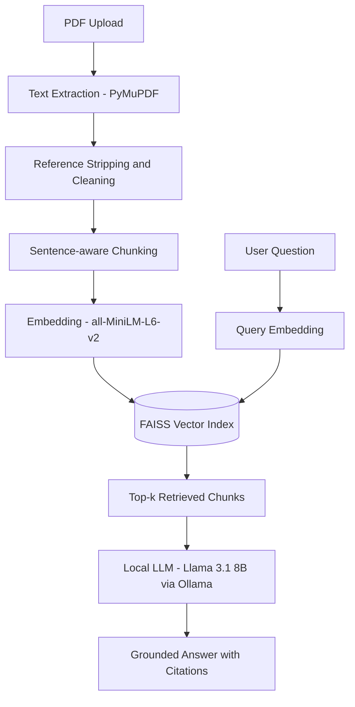

# Research Paper Q&A System (RAG)

A retrieval-augmented generation system for asking natural-language questions
about research papers, with answers grounded in the paper's actual text and
fully verifiable source citations. Runs entirely locally: no external API
calls, no data leaving your machine.

**Status:** Phase 1 prototype complete (single-document Q&A). See
[Roadmap](#roadmap) for what's next.

## How it works



1. **Extraction:** PyMuPDF pulls raw text from the uploaded PDF, then a
   cleaning step rejoins line-broken words, strips the reference list, and
   normalizes whitespace.
2. **Chunking:** text is split into ~180-word, sentence-respecting chunks
   with overlap, so no chunk exceeds the embedding model's token limit and
   no idea gets isolated at a chunk boundary.
3. **Embedding:** each chunk is converted into a 384-dimensional vector via
   a pretrained Sentence Transformer, normalized so cosine similarity search
   is exact.
4. **Indexing:** vectors are stored in a FAISS flat (exact search) index.
5. **Retrieval:** a question is embedded the same way, and the top-k most
   similar chunks are retrieved by cosine similarity.
6. **Generation:** retrieved chunks are passed as context to a locally
   running LLM (Llama 3.1 8B via Ollama), which is explicitly instructed to
   answer only from that context and cite which excerpt supports each claim.

## Tech stack

| Component | Choice | Why |
|---|---|---|
| PDF extraction | PyMuPDF | Reliable text extraction, handles academic layouts well |
| Embeddings | `all-MiniLM-L6-v2` (Sentence Transformers) | Fast, strong baseline, small enough to run alongside the LLM on 8GB VRAM |
| Vector search | FAISS (`IndexFlatIP`) | Exact cosine-similarity search; brute-force is correct at this scale (no approximation tradeoff needed) |
| LLM | Llama 3.1 8B, via Ollama | Fully local inference, no API cost or external data exposure |
| UI | Gradio | Fast to build for a Python-only prototype |

No LangChain / LlamaIndex — the pipeline is built directly against each
library so every step is explicit and explainable.

## Setup

Requires an NVIDIA GPU with CUDA support for reasonable LLM inference speed
(tested on an 8GB laptop GPU).

```bash
# 1. Create/activate your Python environment (conda, venv, etc.)
conda activate <your-env>

# 2. Install dependencies
pip install pymupdf faiss-cpu gradio ollama
pip install sentence-transformers --no-deps   # avoids touching an existing torch install

# 3. Install and start Ollama, pull the model
curl -fsSL https://ollama.com/install.sh | sh
ollama serve &          # leave running in a separate terminal if not using systemd
ollama pull llama3.1:8b
```

## Usage

```bash
python app.py
```

Open the local URL shown in the terminal (typically `http://127.0.0.1:7860`),
upload a PDF, and ask questions once it's indexed.

## Project structure

```text

research-paper-rag/
├── data/uploads/            # uploaded PDFs land here at runtime
├── src/
│   ├── pdf_processor.py     # extraction, reference stripping, cleaning
│   ├── chunker.py           # sentence-aware overlapping chunking
│   ├── embedder.py          # Sentence Transformer wrapper
│   ├── vector_store.py      # FAISS index + retrieval
│   ├── llm.py               # Ollama LLM call + grounded-answer prompting
│   └── rag_pipeline.py      # ties the above into one pipeline object
├── app.py                   # Gradio UI, entry point
├── requirements.txt
└── README.md

```

## Design decisions worth noting

- **Normalized embeddings + inner-product FAISS index** = exact cosine
  similarity search at FAISS's fastest index type.
- **Sentence-boundary-aware chunking**, not naive character splitting —
  avoids both mid-sentence cuts and silent embedding-model truncation
  (MiniLM has a 256-token hard limit).
- **Explicit groundedness prompting** — the LLM is instructed to answer only
  from retrieved context and to say so when the context is insufficient,
  rather than blending in its own pretrained knowledge unmarked.

## Known limitations

- Single document per session (no multi-paper corpus yet)
- No re-ranking: retrieval quality depends entirely on the initial
  embedding similarity, which can miss chunks containing exact
  numbers/values even when conceptually related chunks rank higher
- No automated faithfulness/retrieval evaluation yet (manual testing only)
- No persistence: re-uploading a paper re-indexes it from scratch

## Roadmap

- [ ] Multi-document support with a persistent vector database (Chroma)
- [ ] Hybrid search (BM25 + dense) and cross-encoder re-ranking
- [ ] RAGAS-based retrieval and faithfulness evaluation
- [ ] Conversational multi-turn memory
- [ ] FastAPI backend + Docker + cloud deployment