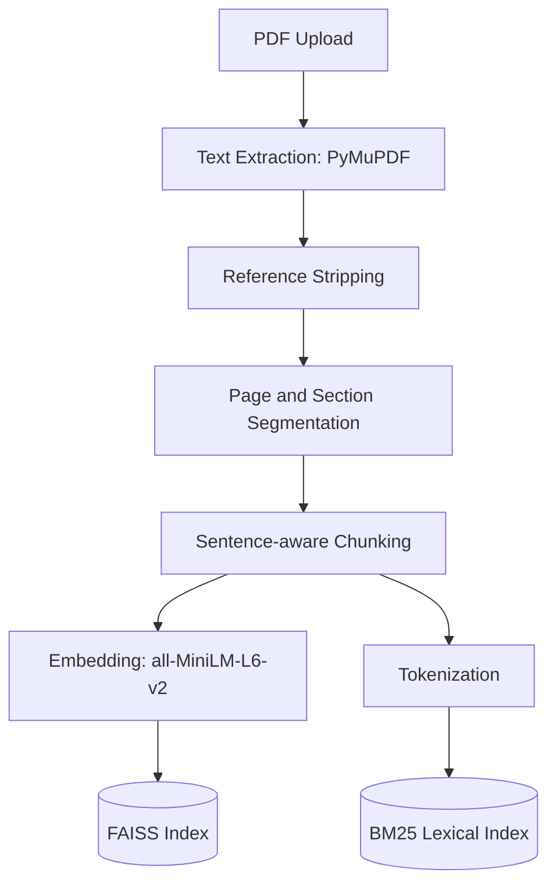
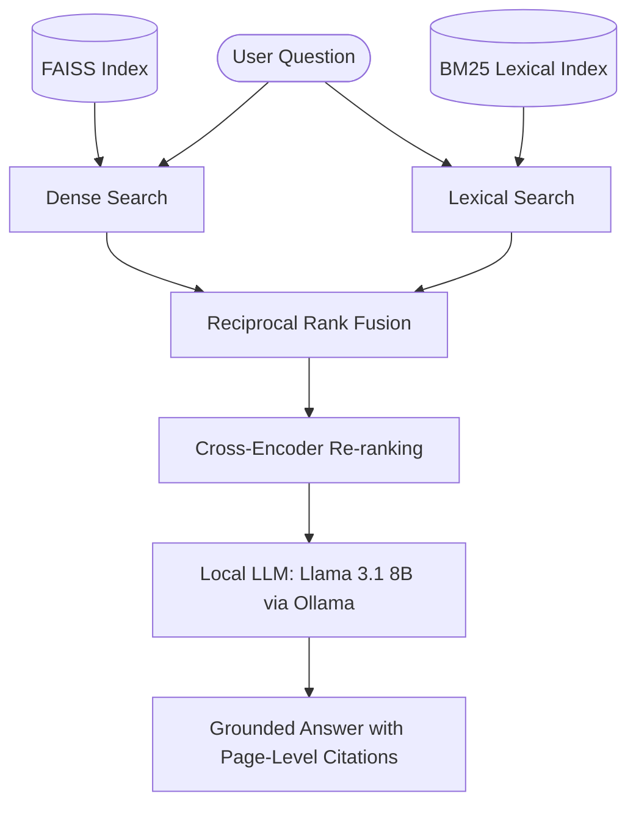

# Research Paper Q&A System (RAG)

A retrieval-augmented generation system for asking natural-language questions
across a library of research papers, with answers grounded in the papers'
actual text and citations down to the page and section. Runs entirely
locally: no external API calls, no data leaving your machine.

**Status:** Phase 2 complete - persistent multi-paper library, hybrid
retrieval, cross-encoder re-ranking, and a measured retrieval benchmark.
Validated on a 16-paper corpus spanning six fields: **100% paper-level
routing, 92% answer accuracy, zero hallucinations** over 39 questions
([full evaluation](EVALUATION.md)). See [Roadmap](#roadmap) for what's next.

**New here?** [RUNNING.md](RUNNING.md) walks through setup, starting and
stopping everything, and troubleshooting.

## How it works

**Indexing, once per paper**



**Answering, once per question**



1. **Extraction:** PyMuPDF pulls text page by page, then the reference list is
   stripped and section headings are detected, so every piece of text keeps a
   record of the page and section it came from.
2. **Chunking:** text is split into ~180-word, sentence-respecting chunks with
   overlap. Chunks never span a section boundary, so a chunk's section label is
   always truthful for all of its text.
3. **Indexing:** each chunk is embedded into a 384-dimensional vector (FAISS,
   exact cosine similarity) *and* indexed lexically (BM25). Both indexes cover
   the whole library, not one paper.
4. **Retrieval:** a question is run through both indexes, the two rankings are
   fused with Reciprocal Rank Fusion, and the top ~20 candidates are re-scored
   by a cross-encoder that reads the question and each passage together.
5. **Generation:** the top passages, each labelled with its paper, page, and
   section, are passed to a locally running LLM instructed to answer only from
   that context and cite the excerpt behind every claim.

## Why hybrid retrieval

Dense embedding search matches on *meaning*, which is what you want for
"what mechanism removes oxygen at 70 km" and exactly what you don't want for
"what value of Kzz was used". A sentence transformer maps `1e4 cm2/s` and
`1e7 cm2/s` to nearly the same vector - the semantics are identical, only the
number differs - so the chunk holding the specific value has no particular
reason to outrank its neighbours. That was the main retrieval failure left
open at the end of Phase 1.

BM25 has the opposite bias: it scores exact term overlap weighted by rarity,
and rare terms are exactly what identifiers, symbols, and numeric values are.
Fusing the two rankings covers each method's blind spot with the other's
strength, and the cross-encoder then re-reads the survivors to fix the cases
where both first-stage retrievers guessed wrong.

### Measured results

Thirty-nine labelled questions across a **16-paper, 802-chunk corpus**
(`eval/corpus_queries.json`), retrieval unscoped so every query must find its
own paper among all 16. A chunk counts as relevant only if it comes from the
right paper *and* contains the answer text:

| mode | Hit@5 | MRR@5 | P@5 | sec/query |
|---|---|---|---|---|
| dense (Phase 1 behaviour) | 0.82 | 0.705 | 0.50 | 0.019 |
| bm25 | 0.95 | 0.813 | 0.54 | 0.001 |
| hybrid | 0.92 | 0.787 | 0.53 | 0.004 |
| **hybrid + rerank** | **0.97** | **0.881** | **0.58** | 0.247 |

Reproduce with:

```bash
python -m scripts.compare_retrieval --k 5 --verbose
```

Reading the numbers honestly:

- **Scale is what justifies hybrid retrieval.** Dense-only search - the whole
  Phase 1 strategy - drops to 0.82 Hit@5 once 16 unrelated papers share one
  index, while BM25 rises to 0.95. On a single paper the two were nearly
  tied; the gap only opens at library scale, because exact terms are what
  distinguish one paper from another.
- **Re-ranking buys ranking quality, not recall.** It lifts MRR from 0.787 to
  0.881 - the right passage moves to rank 1 instead of sitting at 3 or 4.
  That matters because LLM attention degrades over long contexts: evidence at
  rank 1 gets used, evidence at rank 5 often doesn't.
- **Fusion alone can lose a result one retriever found.** When the answer
  term never appears in the question, the other retriever contributes noise
  that pushes the correct chunk out of the fused top-k; the cross-encoder
  recovers it from the wider candidate pool. This is the argument for the
  two-stage design (wide pool, then re-rank) over fusion alone.
- **The re-ranker costs ~0.25s per query.** Irrelevant next to 3-30s of LLM
  generation, which is why it is the default.

The pool size behind those numbers was tuned by sweep, not intuition:
widening it from 20 to 30 lifts MRR@5 from 0.861 to 0.881, while weighting
BM25 above dense in fusion never helps - so RRF stays parameter-free.

## Tech stack

| Component | Choice | Why |
|---|---|---|
| PDF extraction | PyMuPDF | Reliable text extraction, handles academic layouts well; font-size data drives title detection |
| Embeddings | `all-MiniLM-L6-v2` | Fast, strong baseline, small enough to run alongside the LLM on 8GB VRAM |
| Dense search | FAISS (`IndexFlatIP`) | Exact cosine-similarity search; brute-force is correct at this scale |
| Lexical search | Okapi BM25, implemented in `src/bm25.py` | ~60 lines, no dependency, and the scoring formula is worth being able to explain |
| Fusion | Reciprocal Rank Fusion | Cosine scores and BM25 scores aren't on comparable scales; RRF fuses on rank and sidesteps the problem |
| Re-ranking | `cross-encoder/ms-marco-MiniLM-L-6-v2` | Reads question and passage jointly; too slow for full search, ideal as a second stage |
| Persistence | FAISS + numpy + JSON | See below |
| LLM | Llama 3.1 8B, via Ollama | Fully local inference, no API cost or external data exposure |
| UI | Gradio | Fast to build for a Python-only prototype |

No LangChain / LlamaIndex - the pipeline is built directly against each
library so every step is explicit and explainable.

**On not using a vector database:** the Phase 1 roadmap named Chroma. It was
dropped deliberately. This project runs against a CUDA 12.8 nightly torch
build for Blackwell GPU support, and chromadb brings its own pydantic and
onnxruntime pins - real risk to a working environment for no functional gain
at a scale where brute-force search is already exact. Persistence is instead
`embeddings.npy` + `chunks.json` + `documents.json`, with the FAISS index
rebuilt from the embeddings on load. Keeping only the source of truth on disk
means a stale index can never disagree with the chunks it indexes, and the
index type stays free to change later without invalidating anything stored.

## Setup

Requires an NVIDIA GPU with CUDA support for reasonable LLM inference speed
(tested on an 8GB laptop GPU).

```bash
# 1. Create/activate your Python environment (conda, venv, etc.)
conda activate <your-env>

# 2. Install dependencies
pip install pymupdf faiss-cpu gradio ollama pytest
pip install sentence-transformers --no-deps   # avoids touching an existing torch install

# 3. Install and start Ollama, pull the model
curl -fsSL https://ollama.com/install.sh | sh
ollama serve &          # leave running in a separate terminal if not using systemd
ollama pull llama3.1:8b
```

## Usage

### Web interface

```bash
python app.py
```

Open the local URL shown in the terminal (typically `http://127.0.0.1:7860`).
The **Library** tab indexes and removes papers; the **Ask** tab answers
questions against any subset of them, with the retrieval strategy selectable
so the difference between modes is visible rather than buried in a config
file. The library persists, so papers indexed in one session are still there
the next time the app starts.

### Command line

```bash
# Manage the library
python -m src.corpus add data/uploads/paper.pdf
python -m src.corpus list
python -m src.corpus remove <doc_id>

# Ask a question (optionally choosing a retrieval mode)
python -m src.rag_pipeline "What eddy diffusion coefficient was used?"
python -m src.rag_pipeline "What Kzz was used?" dense

# Benchmark retrieval strategies
python -m scripts.compare_retrieval --k 5 --verbose

# Run the tests
pytest tests/ -q
```

Every module also runs standalone for inspection, e.g.
`python -m src.pdf_processor <pdf>` prints the detected sections and
`python -m src.bm25 <pdf>` shows lexical retrieval in isolation.

## Project structure

```text
research-paper-rag/
├── data/
│   ├── uploads/             # PDFs, stored under their document id
│   └── corpus/              # persistent index (generated, gitignored)
├── src/
│   ├── api.py               # FastAPI backend over the pipeline
│   ├── pdf_processor.py     # extraction, reference stripping, page/section segmentation
│   ├── chunker.py           # sentence-aware chunking with page/section provenance
│   ├── embedder.py          # Sentence Transformer wrapper
│   ├── vector_store.py      # multi-document FAISS index + scoped search
│   ├── bm25.py              # Okapi BM25 lexical index
│   ├── reranker.py          # cross-encoder re-ranking
│   ├── retriever.py         # hybrid retrieval + Reciprocal Rank Fusion
│   ├── corpus.py            # persistent document library
│   ├── llm.py               # Ollama call + grounded-answer prompting
│   └── rag_pipeline.py      # ties the above into one pipeline object
├── scripts/
│   ├── compare_retrieval.py # retrieval benchmark
│   └── validate_queries.py  # checks a test set is actually answerable
├── eval/
│   ├── corpus_queries.json  # 39-query, 16-paper retrieval test set
│   └── venus_queries.json   # single-paper test set (Phase 1 comparison)
├── tests/                   # 111 unit tests
├── app.py                   # Gradio UI, entry point
├── EVALUATION.md            # 16-paper test results and fixes
├── RUNNING.md               # setup, start/stop, troubleshooting
├── requirements.txt
└── README.md
```

## Design decisions worth noting

- **Normalized embeddings + inner-product FAISS index** = exact cosine
  similarity search at FAISS's fastest index type.
- **Chunks never span a section boundary** - a chunk's section label is
  therefore true of all its text, so a citation can never point a reader at
  the wrong part of the paper.
- **Relevance judged by content, not chunk id.** The retrieval test set marks
  a chunk relevant if it contains the required phrases. Hand-labelled chunk
  ids would silently rot the first time chunk size or overlap changed.
- **Document scoping uses a FAISS id selector**, not over-fetch-and-filter,
  which would quietly return too few results whenever one paper dominates the
  rankings.
- **Embeddings are persisted, not just the index.** They are the expensive
  artifact and they are tiny (~1.5 KB/chunk); keeping them makes document
  removal a pure array operation instead of a full re-index.
- **Explicit groundedness prompting** - the LLM answers only from retrieved
  context, cites an excerpt per claim, and is told to flag disagreement
  between papers rather than silently picking one.

## Known limitations

- **Re-ranking is not domain-adapted.** The cross-encoder is trained on MS
  MARCO web passages. When the answer term never appears in the question
  ("what does *Adam* stand for?" → "adaptive moment estimation") it can
  demote the single relevant chunk out of the top 5 even when BM25 ranked it
  2nd. This is the only outright failure in 39 test questions.
- **Equation-heavy content degrades.** Symbols, subscripts, and Unicode maths
  do not survive PDF text extraction intact, so questions whose answer *is*
  an equation get vague or garbled responses. This is a limit of the source
  text, not of retrieval.
- **Section detection is heuristic.** It combines numbered headings, known
  section names, and font size relative to body text. Scanned papers with
  unstable typography still produce some odd section labels.
- **Scanned PDFs are rejected**, not OCR'd - indexing fails with a clear
  message rather than silently indexing nothing.
- **No conversational memory.** Each question is answered independently;
  follow-ups like "what about at 60 km?" carry no context. The `history`
  parameter in `llm.generate_answer` is in place for this.
- **No automated faithfulness evaluation.** Retrieval quality is measured;
  whether the generated answer is faithful to the retrieved context is not.
- **Single-user, single-process.** No API layer, no concurrency control.

## Roadmap

- [x] ~~Multi-document support with a persistent vector database~~ (Phase 2 - persistent multi-document corpus, FAISS + JSON rather than Chroma)
- [x] ~~Hybrid search (BM25 + dense) and cross-encoder re-ranking~~ (Phase 2)
- [x] ~~Retrieval evaluation~~ (Phase 2 - Hit@k / MRR / P@k benchmark)

**Phase 3 - accuracy, then capability.** The first two items address the two
measured weaknesses from the [16-paper evaluation](EVALUATION.md); they are
listed first because they are the only items that move answer accuracy.
Everything else in Phase 3 adds measurement or surface area, not correctness.

- [ ] Domain-adapted re-ranking, replacing the MS MARCO cross-encoder that
      demotes correct passages when the answer term is absent from the
      question (Phase 3)
- [ ] Equation, symbol, and table extraction, so answers that *are* a
      formula stop degrading into garbled Unicode (Phase 3)
- [x] ~~Per-document retrieval quotas, so a question spanning two papers can
      reach both instead of spending its whole passage budget on one~~
      (Phase 3, done: applied only to questions that read as comparative,
      since applying it to every question costs Hit@5 0.97 to 0.92)
- [ ] RAGAS-based answer faithfulness and groundedness evaluation (Phase 3)
- [ ] Conversational multi-turn memory with query rewriting (Phase 3)
- [x] ~~FastAPI backend, replacing direct Gradio-to-pipeline calls~~
      (Phase 3, done: `src/api.py`, see [RUNNING.md](RUNNING.md) section 9)

**Phase 4 - deployment.**

- [ ] Docker containerization and cloud deployment (Phase 4)
- [ ] Modern web frontend against the API (Phase 4)
